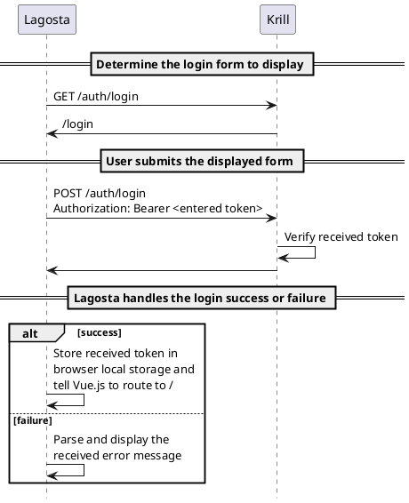
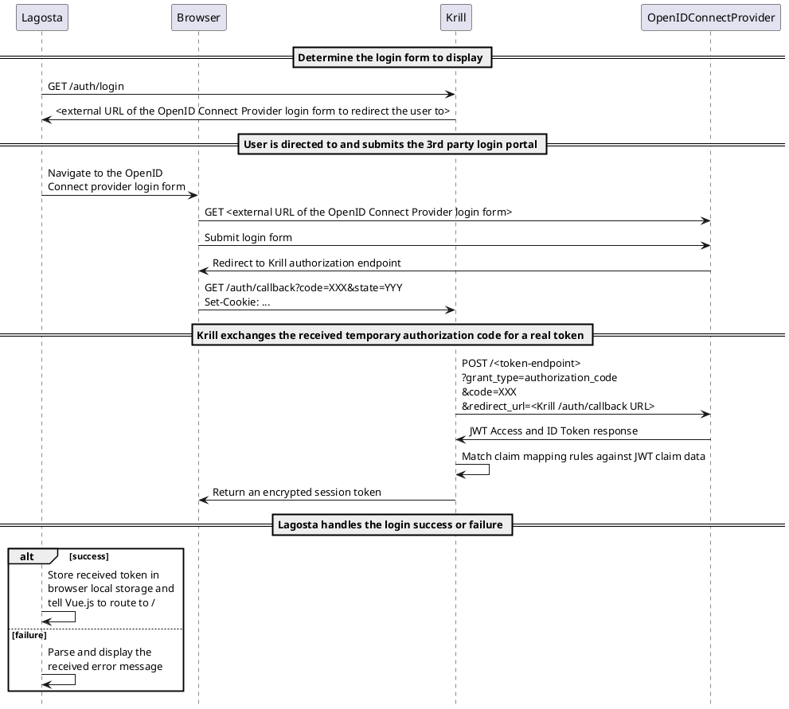

# Multi-User Feature: Login Flows

The HTTP request-response flow when logging in to the Krill web UI (aka Lagosta) is quite involved when using OpenID Connect. The logic within Lagosta also became more complex with the addition of multi-user support as it has to ensure that it shows the appropriate login form or redirects to an external form (e.g. for OIDC) and has to handle the different ways it is returned to at the end of the login process and the different kinds of error that can occur.

While you can in theory work out these flows by looking at the code and by capturing requests and responses and inspecting logs it is not trivial and the details are easily forgotten if you don't have to look at it for a while. To help with diagnosing issues and understanding the flow through the code this page tries to show visually how these processes work.

## Common behaviour

For all auth types, when Lagosta (in `router.js`) routes the user to the correct Vue.js "view",  it checks if the user is authorized using the Krill `GET /api/v1/authorized` REST API endpoint. If not they will be shown the login page that Krill reports via its `GET /auth/login` REST API endpoint. This will either be an externally hosted 3rd party login portal e.g. of an OpenID Connect provider, or a login Vue.js "view" internal to Lagosta. 

When making requests to the Krill REST API, a special browser-side Axios request handler function `authHeader()` checks for a `krill_user` value stored in browser local storage and if found injects an `Authorization: Bearer ${krill_user}` HTTP header into the request.

If the user is neither logged in according to Krill or Lagosta the login URL will be determined by calling the Krill REST API `GET /auth/login`. If the URL starts with `http` it is treated as an external login URL (e.g. an OpenID Connect provider login portal) to direct the browser to navigate to. Otherwise it is treated as the name of a login "view" internal to Lagosta that Vue.js should switch to.

## `auth_type = "admin-token"`

With this configuration the Krill `GET /auth/login` REST API endpoint responds with `/login` which causes the user to be shown the internal Lagosta login page which has existed in Krill since Krill first had a web UI. This login page challenges the user to provide the correct admin token. The approximate flow is thus:

## `auth_type = "config-file"`

With this configuration the Krill `GET /auth/login` REST API endpoint responds with `/login?withId=true`. The same internal login form is shown as with `auth_type = "admin-token"` but with two differences:

1. A hidden additional login field for the user ID is revealed. This allows the user to enter a username and password pair.
2. The entered password is not sent as-is in the bearer token, instead it is hashed using the `scrypt` algorithm and a salt based in part on the entered login ID and the hash is sent as the bearer token.

## `auth_type = "openid-connect"`

With OpenID Connect the flow is different:

