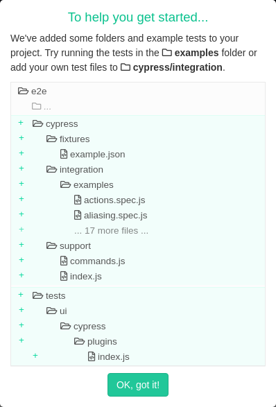

# Multi-User: Testing

Testing the multi-user functionality is primarily done at the integration testing level, that is integration tests as
Rust [defines them](https://doc.rust-lang.org/rust-by-example/testing/integration_testing.html).

At the lowest level, any test that exercises Krill from the outside will exercise the multi-user code because all
external and internal actions require an `Actor` instance, and all external requests must pass authentication and
authorization checks.

However, not all tests will exercise login as that is only used by Lagosta. The existing Krill integration tests use a
fixed admin API token without login because that was all Krill supported before, and must continue to work for the
direct REST API clients and indirect REST API client via `krillc`.

Also, as the multi-user feature is aimed entirely (at present) at Lagosta users, it only works if it works from the UI
all the way down to the event log, testing at the Krill internal library boundary or the Krill REST API boundary is
not sufficient.

As such most of the multi-user tests use [Cypress](https://cypress.io) to drive a headless browser connecting to a
locally launched instance of Krill, and for the OpenID Connect tests a homebrewed mock Rust OpenID Connect provider is
run in-process alongside Krill as well.

For ease Cypress is invoked via Docker as it has an official Docker image which contains everything needed. However,
this has not yet been verified as working on Mac OS. Cypress in turn is driven by test suites defined in Javascript.

As UI based tests can be quite slow they are gated behind their own `ui-tests` feature, which also has the benefit
that users without a working Docker setup are still able to run `cargo test`.

To run the UI tests one must therefore do:

```
cargo test --features ui-tests
```

Cypress has a very useful interactive test run mode which can be launched like so:

```
$ xhost +
$ CYPRESS_INTERACTIVE=1 cargo test --features ui-tests <some_test_name>
```

You want the `<some_test_name>` because you want Krill to be setup correctly to run a particular test that you will then run interactively, you don't want Krill to run all tests and constantly be changing the backend state as a result while you try to use Cypress to run a single test suite that has expectations about the state that Krill is in.

For example you might do:
```
$ xhost +
$ CYPRESS_INTERACTIVE=1 cargo test --features ui-tests multi_user_config_file_with_ta
```

After a short delay a browser window should open with a Cypress welcome message something like this:



Dismiss the message and then click on the `multi_user_config_file_with_ta.js` test in the tree of tests that is shown to you, i.e. run the same test as you invoked with `cargo test` so that Krill has the expected configuration and starting conditions.

You should then see something like this:


