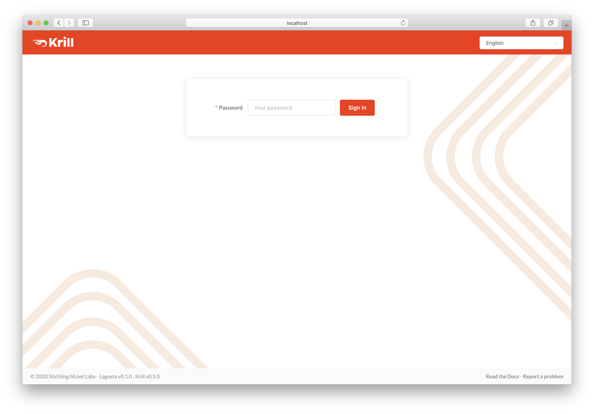
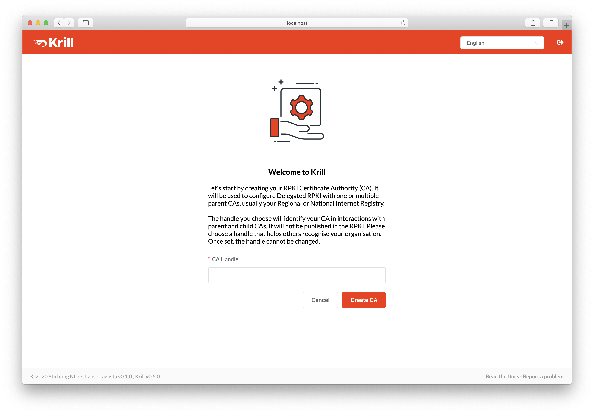
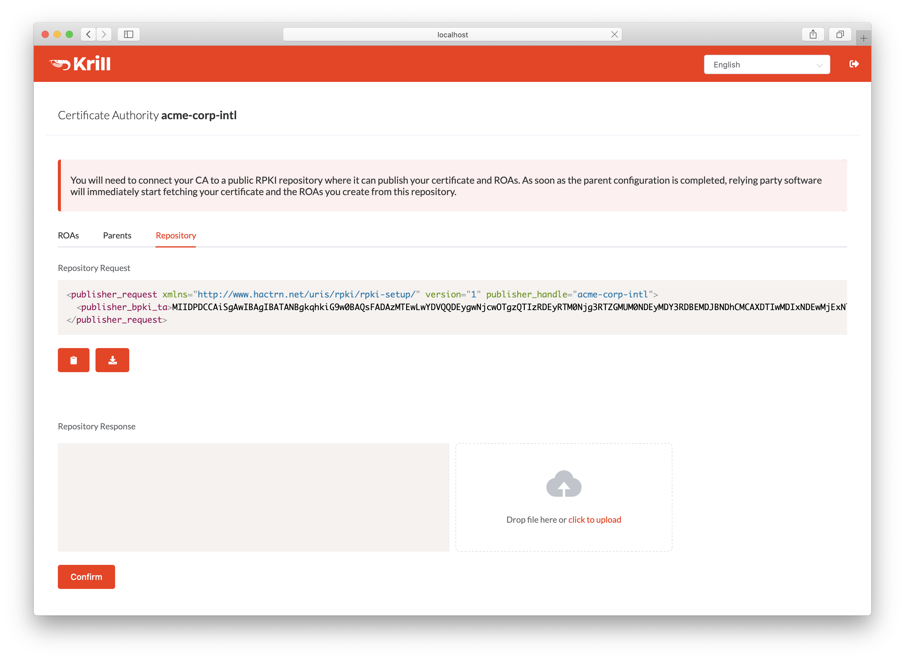
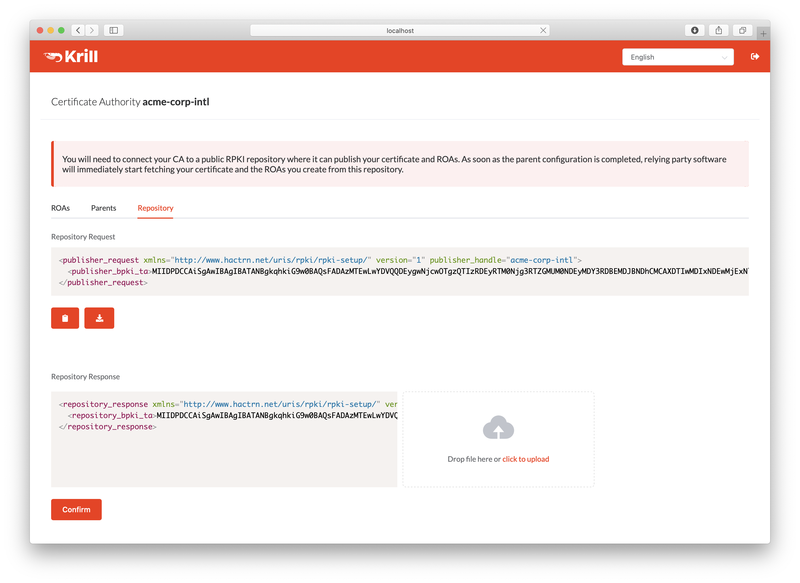
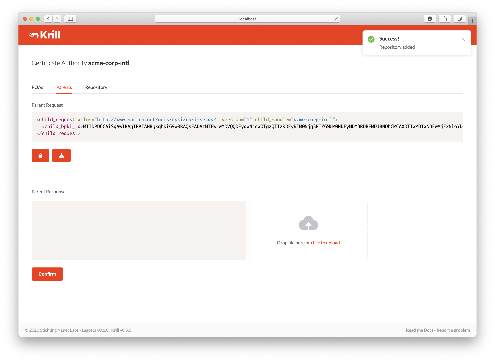
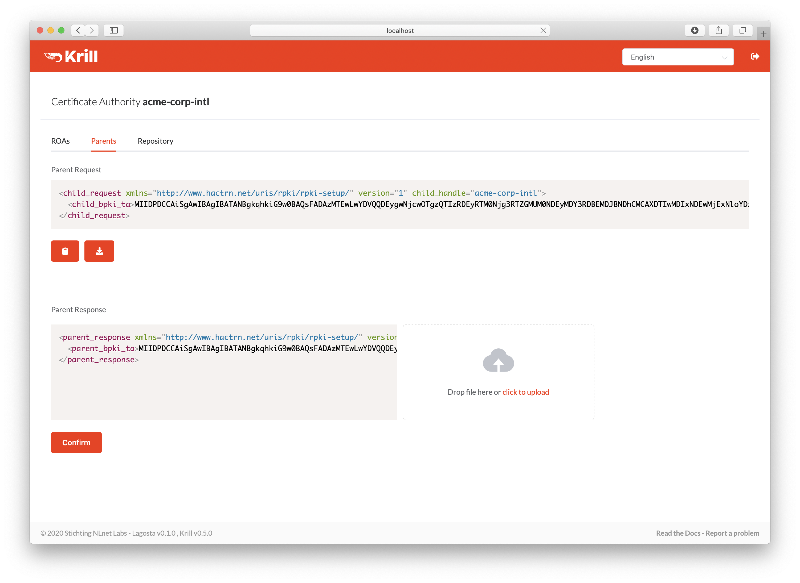

.. _doc_krill_get_started:

Get Started with Krill
======================

Before you can start managing your own ROAs you need to do a one time setup
where you:

- create your CA
- connect to Publication Server
- connect to Parent CA (typically a Regional or National Internet Registry)

This can be easily achieved using the user interface. Connecting to the
Publication Server and Parent CA is done by exchanging a couple of XML files. After
this initial setup, and you can simply :ref:`manage your ROAs<doc_krill_manage_roas>`.

If you just want to try out Krill (or a new version) you can use the
:ref:`testbed<doc_krill_testbed>` provided by NLnet Labs for this.

If you are using the defaults you can access the user interface in a browser on
the server running Krill at ``https://localhost:3000``. By default, Krill generates
a self-signed TLS certificate, so you will have to accept the security warning
that your browser will give you.

If you want to access the UI, or use the CLI, from another computer, you can
either :ref:`set up a reverse proxy<proxy_and_https>` on your server
running Krill, or set up local port forwarding with SSH, for example:

.. code-block:: bash

  ssh -L 3000:localhost:3000 user@krillserver.example.net

Here we will guide you through the set up process using the UI, but we will also
link to the relevant subcommands of the :ref:`command line interface (CLI)<doc_krill_cli>`

Login
-----

.. tip:: To login to the web user interface using named users instead of the secret token, see :ref:`Login with Named Users<doc_krill_multi_user>`.

The login will ask you to enter the secret token you configured for Krill.

    Enter your secret token to access Krill

If you are using the CLI you will need to specify the token using the `--token`
option. Because the CLI does not have a session, you will need to specify this
for each command, or you set the the `KRILL_CLI_TOKEN` environment variable and
save yourself the trouble of repeating it.

Create your Certification Authority
-----------------------------------

Next, you will see the Welcome screen where you can create your Certification
Authority (CA). It will be used to configure delegated RPKI with one or multiple
parent CAs, usually your Regional or National Internet Registry.

The handle you select is not published in the RPKI but used as identification to
parent and child CAs you interact with. Please choose a handle that helps others
recognise your organisation. Once set, the handle cannot be changed.

    Enter a handle for your Certification Authority

If you are using the CLI you can create your CA using the subcommand :ref:`krillc add<cmd_krillc_add>`.

.. _doc_krill_using_ui_repository_setup:

Repository Setup
----------------

.. Note:: If you are a member of NIC.BR, ARIN or APNIC, then you're in luck. These
    organisations provide an RPKI Publication Server as a service to their
    members, so you can configure your Krill CA publish there.

    If you need to run your own Publication Server then please have a look
    :ref:`here<doc_krill_publication_server>` to see how you can use Krill
    to achieve this.

    In either case the same process described below applies from your Krill
    CA's perspective.

Before Krill can request a certificate from a parent CA, it will need to know
where it will publish. You can add a parent before configuring a repository for
your CA, but in that case Krill will postpone requesting a certificate until
you have done so.

In order to register your CA as a publisher, you will need to copy the RFC 8183
Publisher Request XML and supply it to your Publication Server. You can retrieve
this file with the CLI subcommand :ref:`krillc repo request<cmd_krillc_repo_request>`,
or you can simply use the UI:

    Copy the publisher request XML or download the file

Your publication server provider will give you a repository response XML. You
can use the CLI subcommand :ref:`krillc repo configure<cmd_krillc_repo_configure>` to
add this configuration to your CA, or you can simply use the UI:

    Paste or upload the repository response XML

.. Note:: Migrating to a new Repository later is not supported through the
    web UI, but :ref:`you can use the CLI to do this<doc_krill_ca_migrate_repo>`.

.. _doc_krill_using_ui_parent_setup:

Parent Setup
------------

After successfully configuring the repository, the next step is to configure
your parent CA. You will need to present your CA's RFC 8183 Child Request XML
file to your parent. You can get this file using the CLI subcommand
:ref:`krillc parents request<cmd_krillc_parents_request>`, or you can simply
use the UI:

    Copy the child request XML or download the file

Your RIR or NIR will provide you with a parent response XML. You can use the
CLI subcommand :ref:`krillc parents add<cmd_krillc_parents_add>` for this, or
you can simply paste or upload it using the UI:

    Paste or upload the parent response XML
