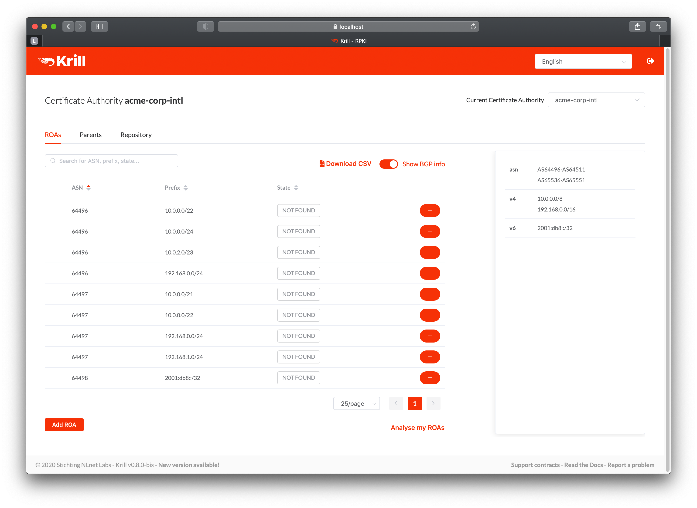
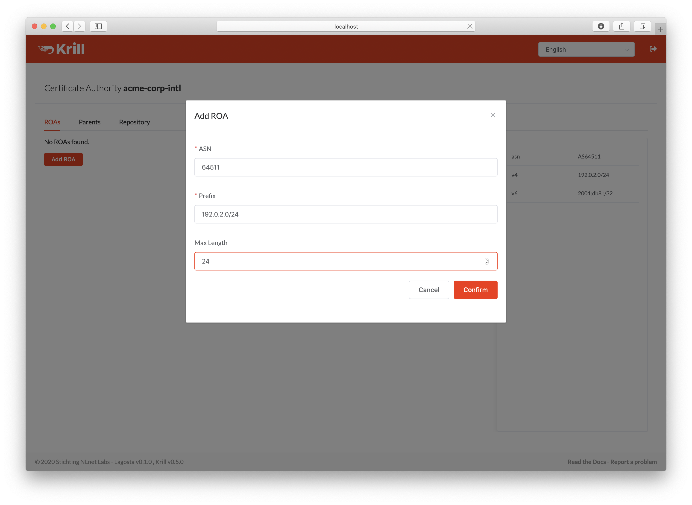

.. _doc_krill_manage_roas:

Manage ROAs
===========

Once you have successfully :ref:`set up the parent and repository<doc_krill_get_started>`,
you are now running delegated RPKI. You can now start creating ROAs.

.. _krill_roa_bgp_empty:

Show BGP Info
-------------

Krill automatically downloads BGP announcement information from RIPE RIS and
uses this to analyse the known BGP announcements for the address space on your
resource certificate(s). This allows Krill to show the RPKI validation status
of your announcements, warn about possible issues, and do some suggestions on
ROAs you may want to create or remove.

Krill recognises the following 'States' in its analysis:

=============== =========================================================================================
State           Explanation
=============== =========================================================================================
NOT FOUND       This announcement is not covered by any of your ROAs

INVALID ASN     | The prefix for this announcement is covered by one or more of your ROAs.
                | However, none of those ROAs allow announcements of this prefix by this ASN.

INVALID LENGTH  | The ASN for this announcement is covered by one or more of your ROAs.
                | However, the prefix is more specific than allowed.

SEEN            | This is a ROA you created which allows at least one known BGP announcement.
                | Note it may also disallow one or more other announcements. You can show details
                | if you click on the '>' icon.

TOO PERMISSIVE  | This ROA uses the max length field to allow multiple announcements, but
                | Krill does not see *all* most specific announcements in its BGP information.

REDUNDANT       | This is a ROA you created which is included in full by at least one other ROA
                | you created. I.e. you have a ROA for the same ASN, covering this prefix and
                | including the maximum length.

NOT SEEN        | This is a ROA you created but it does not cover any known announcements. This
                | may be a ROA you created for a backup or planned announcement. On the other
                | hand, this could also be a stale ROA in which case it is better to remove it.

DISALLOWING     | This is a ROA for which no allowed announcements are seen, yet it **disallows** one
                | or more announcements. If this is done on purpose it may be better to create
                | a ROA for ASN 0 instead.

AS0             | This is a ROA you created for a prefix with ASN 0. Since ASN 0 cannot occur
                | in BGP such ROAs are effectively used to disallow announcements of prefixes
                | on the global BGP table.

REDUNDANT (AS0) | An AS0 ROA is considered redundant in case you have at least one ROA covering
                | the entire prefix for a real ASN. In such cases this ROA does not provide any
                | further protection on top of that existing ROA.

PREFIX REMOVED  ROA cannot be published, its prefix is no longer on your certificate(s)

=============== =========================================================================================

If you just set up your Krill instance you will see that your announcements all
have the status ``NOT FOUND``, meaning that you have not created any ROAs covering
them yet.

    When you first start, all your announcements are 'NOT FOUND'

    .. _krill_roa_suggestions:

ROA Suggestions
---------------

    .. warning:: You should **always** verify the suggestions done by Krill. Krill bases its analysis
                 on information collected by the `RIPE NCC Routing Information Service (RIS) <https://www.ripe.net/analyse/internet-measurements/routing-information-service-ris>`_
                 and saved in aggregated `dumps <http://www.ris.ripe.net/dumps/>`_ every 8 hours. So,
                 the announcements that Krill sees may be outdated. More importantly they may include
                 announcements by others that you do **NOT** wish to allow. And you may not see your
                 own announcements if you inadvertently invalidated them, because such announcements
                 are often rejected and therefore may not reach the RIS Route Collectors.

                 We plan to add support to use other data sources in future, which will allow you to
                 inform Krill about the announcements that you do on your own eBGP sessions.

If you click :guilabel:`Analyse my ROAs` under the table in the ROAs tab, Krill will suggest the
following changes for the following 'State' values:

=============== ========== =============================================================================
State           Add/Remove Notes
=============== ========== =============================================================================
NOT FOUND       Add

INVALID ASN     Add        | Be careful when adding a ROA for a new ASN. The information
                           | is based on what is seen in BGP, but this may include
                           | malicious or accidental hijacks that you do **NOT** wish to
                           | allow.
                           |
                           | NOTE: Krill will not suggest to allow announcements for a new
                           | ASN if you created an AS0 ROA for the prefix.

INVALID LENGTH  Add        | If you are sure that this announcement is valid, then you should
                           | create a ROA for it. However, there is a (remote) chance that
                           | this is a malicious hijack where your ASN was prepended. In
                           | such cases you should of course **NOT** allow it.

TOO PERMISSIVE  BOTH       | Krill will suggest to remove the permissive ROA and replace it
                           | with ROAs for all specific announcements presently seen in BGP.
                           | This is inline with recommendations in `this draft in the IETF <https://tools.ietf.org/html/draft-ietf-sidrops-rpkimaxlen>`_.
                           | However, if you need to pre-provision specific announcements
                           | from your ASN, e.g. for anti DDoS purposes, then you may wish
                           | to keep the permissive ROA as is.

DISALLOWING     Remove     | If you want to create a ROA to disallow announcements then it
                           | may be better to create an AS0 ROA instead.

NOT SEEN        Remove     Keep the ROA if it is for a planned or backup announcement.

REDUNDANT       Remove

PREFIX REMOVED  Remove     | Keep the ROA if you believe that your prefix will be re-added by
                           | any parent.

=============== ========== =============================================================================

.. _krill_add_roa:

Add a ROA
---------

Click the :guilabel:`Add ROA` button, then fill in the authorised ASN and one of your prefixes in the form.
The maximum prefix length will automatically match the prefix you entered to follow best operational
practices, but you can change it as desired.

    Adding a new ROA

If you prefer to use the CLI then you can manage ROAs using the subcommand
:ref:`krillc roas <cmd_krillc_roas>`.

.. _krill_roas_no_bgp:

Disable BGP Info
----------------

If you disable the :guilabel:`Show BGP Info` toggle, Krill will just show you your plain ROAs. You
can also disable downloading the RIS dump files altogether if you set the following directive
in your krill.conf file:

.. code-block:: bash

  bgp_risdumps_enabled = false
