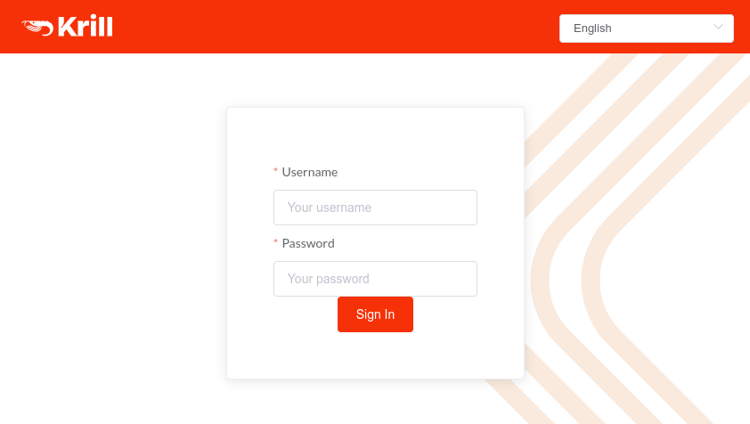

.. _doc_krill_multi_user_config_file_provider:

Config File Users
=================

.. versionadded:: v0.9.0

.. contents::
  :local:
  :depth: 1

Introduction
------------

By setting ``auth_type = "config-file"`` in ``krill.conf`` you can configure
Krill to require users to enter a username and password in the web user
interface when logging in, rather than the secret token that is usually
required:

    Using config file user credentials to login to Krill

.. Note:: It is important to realize that Krill is not a complete user
          management system and that Config File Users therefore have some
          :ref:`limitations <limitations>`.

          While Config File Users are useful as a quick way to test named
          user support in Krill and may suffice for simple situations, in
          larger more critical settings you are strongly advised to consider
          using :ref:`doc_krill_multi_user_openid_connect_provider` instead.

How does it work?
-----------------

To add a user to the ``krill.conf`` file an administrator uses the ``krillc``
command to compute a password *hash* for the user and then adds an entry to
the ``[auth_users]`` section including their username, password *hash*, salt
and :ref:`roll <doc_krill_multi_user_roles>`.

When a user enters their username and password into the web user interface a 
hash of the password is computed and sent with the username to the Krill
server.

The Krill server will verify that the user logging in provided a correct
password and has a role that grants the ``login`` permission. On success
Krill will respond with a token which the web user interface should send on
subsequent requests to authenticate itself with Krill. The web user interface
will keep a copy of this token in browser local storage until the user logs
out or is timed out due to inactivity.

.. tip:: The actual user password is **NEVER** stored on either the Krill
         server nor the client browser and is **NEVER** sent by the client
         browser to the Krill server. Only password *hashes* are stored and
         transmitted.

.. warning:: Do **NOT** serve the Krill web user interface over unencrypted
             HTTP. While the password is never transmitted, the
             authentication token that the user is subsequently issued is
             subject to interception by malicious parties if sent unencrypted
             from the Krill server to the web user interface. Note that this
             is equally true when using any credential to authenticate with
             Krill, whether secret token or password hash or when Krill is
             configured to interact with an OpenID Connect provider.

.. _limitations:

Known limitations
-----------------

Config File Users are easy to define and give you complete control over who
has access to your Krill instance and what level of access is granted.
However, Krill is not a complete user management system and so there are some
things to remember when using Config File Users:

- Krill has no feature for requiring a user to change their password on first
  login. As such, by issuing users with passwords you become responsible for
  delivering the new password to them securely.

- OpenID Connect providers often have support for two-factor authentication
  to protect an account better than just with a username and password. Krill
  does not have this capability.

- Krill has no feature for generating cryptographically strong passwords. You
  are responsible for choosing sufficiently strong passwords for your users.

- Usernames, password hashes and user attributes are sensitive information.
  By adding them to your ``krill.conf`` file you become responsible for
  protecting them.

- If you lose your ``krill.conf`` file you will also lose the password hashes
  and will have to reset your users passwords unless you have a (**secure**)
  copy elsewhere.

- If a user forgets their password you will need to issue them with a new one.
  Krill does not offer a forgotten password or password reset feature.

- Adding or changing users requires a restart of Krill. There is no support
  in Krill at present for reloading the user details while Krill is running.
  While Krill is restarting the web user interface will be unavailable for
  your users.

Setting it up
-------------

The following steps are required to use Config File Users in your Krill setup.

1. Decide on the settings to be configured.
"""""""""""""""""""""""""""""""""""""""""""

Decide which usernames you are going to configure, and what :ref:`role <doc_krill_multi_user_roles>`
and password they should have. For this example let's assume we want to
configure the following users:

================= ======== =========
Username          Password Role
================= ======== =========
joe@example.com   dFdsapE5 admin
sally             wdGypnx5 readonly
dave_the_octopus  qnky8Zuj readwrite
================= ======== =========

----

2. Configure Krill
""""""""""""""""""

For each user generate a password hash and salt using the following command:

.. code-block:: bash

  $ krillc config user --id joe@example.com
  Enter the password to hash: ********
   
  [auth_users]
  "joe@example.com" = { password_hash="521e....0529", salt="d539....115e" }

Then add the ``auth_type``, ``[auth_users]`` and individual user lines
to ``krill.conf``. The end result should look something like this:

.. code-block:: bash

   auth_type = "config-file"

   [auth_users]
   "joe@example.com"  = { role"admin", password_hash="521e....0529", salt="d539....115e" }
   "sally"            = { role="readonly", password_hash="...", salt="..." }
   "dave_the_octopus" = { role="readwrite", password_hash="...", salt="..." }

----

3. Go!
""""""

Restart Krill and deliver the chosen passwords to the respective users to
whom they belong. The users should now be able to login to your Krill
instance.

.. Warning:: Take whatever steps you think are necessary to ensure that the
             passwords are delivered **securely** to your users.

Advanced configuration
----------------------

The information above gives you the basic structure for the configuration
file syntax needed to configure local users in Krill and uses the default
roles provided by Krill. See :ref:`doc_krill_multi_user_roles` for
information how to configure your own set of roles and limit what users
should have access to.

Additional sources of information
---------------------------------

The ``krill.conf`` file is the definitive guide to the possible values that
can be used in the Krill configuration file. If in doubt, consult the 
``krill.conf`` file that came with your copy of Krill.

Login related events will be reported in the Krill logs:

- Login failures are reported at error level.
- Login successes are reported at info level.
- Additional diagnostics may be reported at debug or trace level.

