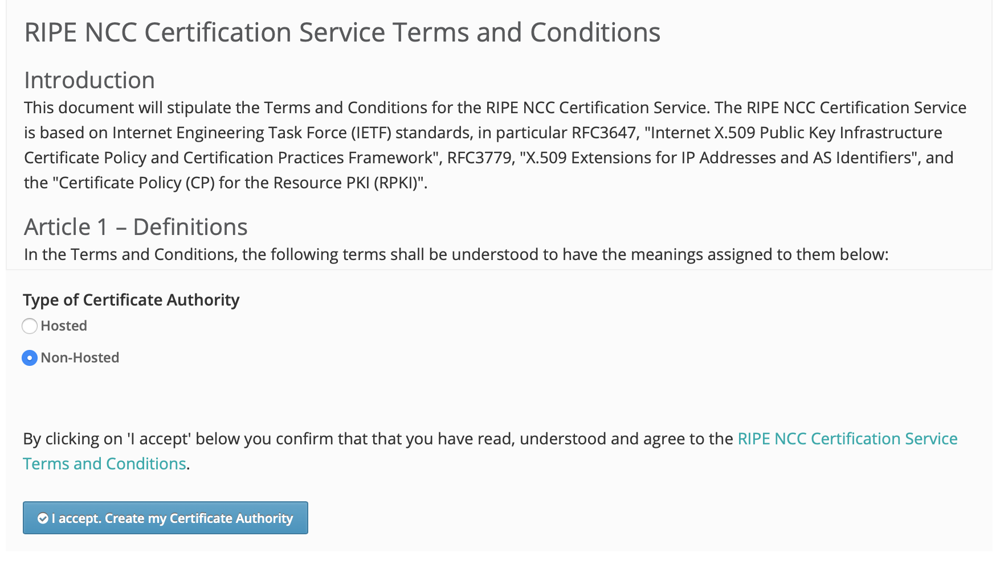

.. _doc_krill_parent_interactions:

RIR and NIR Interactions
========================

In almost all cases, you will interact with one or more Regional Internet
Registries (RIRs) or National Internet Registries (NIRs) when setting up
delegated RPKI.

The fundamental principle is the same with each of them: the RIR or NIR needs to
establish who you are, which resources you are entitled to and where your
RPKI certificate and ROAs will be published.

Your identity, permissions and entitlements are all managed by the registry and
exposed via their respective member portals. The rest of the information is
exchanged in two XML files. You  will need to provide a child request generated
by Krill, and in return you will receive a parent response that you need to give
back to Krill. See :ref:`doc_krill_using_ui_parent_setup` for more details.

Hosted Publication Server
-------------------------

Your RIR or NIR may also provide an RPKI publication server. You are free to
publish your certificate and ROAs anywhere you like, so a third party may
provide an RPKI publication server as well. To use this service you will need to
do an additional exchange. You need to generate and provide a publisher request
file and in return you will receive a repository response.

Using an RPKI publication server relieves you of the responsibility to keep
a public rsync and web server running at all times to make your certificate and
ROAs available to the world.

Of the five RIRs, RIPE NCC, APNIC and ARIN currently offer RPKI publication as a 
service for their members. Note that the RIPE NCC lets you provision multiple
repositories. This way you can delegate resources to other business units or 
customers who in turn run their own CA, who can also publish in the RIPE NCC 
repository instead of having to run their own.

NIC.br, the Brazilian NIR, provides an RPKI repository server for their members
as well. If you need to publish your certificate and ROAs yourself, follow the 
steps described in the :ref:`doc_krill_publication_server` section.

.. _member_portals:

Member Portals
--------------

If you hold resources in one or more RIR or NIR regions, you will need to have
access to the respective member portals and the permission to configure
delegated RPKI.

  :AFRINIC:
       https://my.afrinic.net

  :APNIC:
       https://myapnic.net

  :ARIN:
       https://account.arin.net

  :LACNIC:
       https://milacnic.lacnic.net

  :RIPE NCC:
       https://my.ripe.net

Most RIRs have a few considerations to keep in mind.

AFRINIC
"""""""

AFRINIC have delegated RPKI available in their test environment, but it’s not
operational yet.

APNIC
"""""

If you are already using the hosted RPKI service provided by APNIC and you would
like to switch to delegated RPKI, there is currently no option for this with
MyAPNIC. Please open a ticket with the APNIC help desk to resolve this.

Please note that APNIC offers RPKI publication as a service. It is highly
recommended to make use of this, as it relieves you of the need to run a
highly available repository yourself. We provide a `step-by-step guide
<https://blog.nlnetlabs.nl/running-krill-under-apnic/>`_ to set this up.

ARIN
""""

If you are already using the hosted RPKI service provided by ARIN and you would
like to switch to delegated RPKI, there is currently no option for this with
ARIN Online. Please open a ticket with the ARIN help desk to resolve this.

Please note that ARIN offers RPKI publication as a service. It is
highly recommended to make use of this, as it relieves you of the need to run a
highly available repository yourself. We provide a `step-by-step guide
<https://blog.nlnetlabs.nl/running-krill-under-arin/>`_ to set this up.

LACNIC
""""""

Although LACNIC offers delegated RPKI, it is not possible to configure this in
their member portal yet. While the procedures are still being defined, please
open a ticket via hostmaster@lacnic.net to get started.

RIPE NCC
""""""""

When you are a RIPE NCC member who does not have RPKI configured, you will be
presented with a choice if you would like to use hosted or non-hosted RPKI.

    RIPE NCC RPKI setup screen

If you want to set up delegated RPKI with Krill, you will have to choose
non-hosted. If you are already using the hosted service and you would like to
switch, then at the bottom right corner of the RPKI dashboard in the LIR Portal
you'll find a red link saying "Revoke hosted CA". Click it, check all the 
checkmarks in the dialog box, and fill in the required fields. 

Now, you'll now land at the start page to set up your Certificate Authority. 
Select the "Delegated" radio button and accept the Terms & Conditions to create
your new CA.

Please note that RIPE NCC offers RPKI publication as a service. It is
highly recommended to make use of this, as it relieves you of the need to run a
highly available repository yourself. We provide a `step-by-step guide
<https://blog.nlnetlabs.nl/running-krill-under-ripe-ncc/>`_ to set this up.
